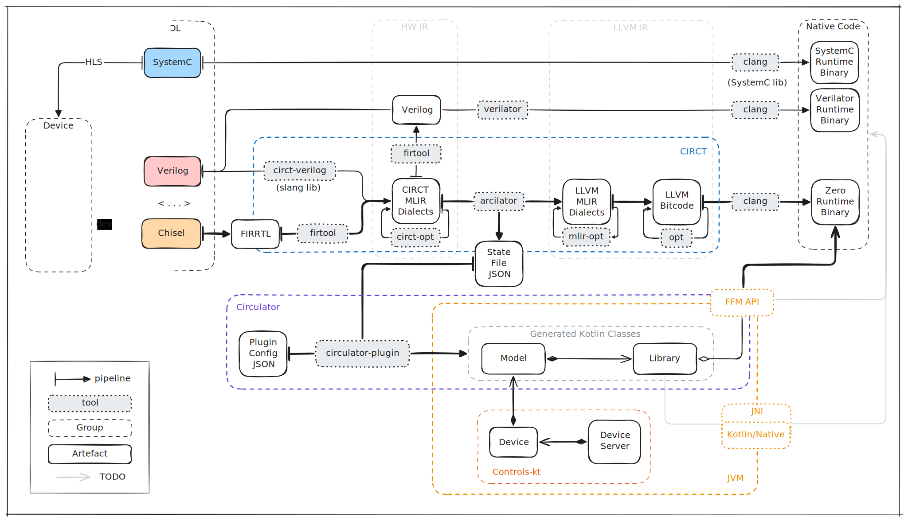

# Architecture Notes

This library initially was targeted as [Controls.kt Framework](https://github.com/sciprogcentre/controls-kt) feature for running
device models in circuit level as it is useful for constructing and testing SCADA systems built on top of it. But a decision was made to
separate the library from the Controls.kt project and design it as some kind of bridge to native models.

## Circulator.kt pipeline

A pipeline of converting hardware device model in HDl to Kotlin code is shown in diagram below.

### Chisel-Circulator problem

Chisel relies on running Scala code to generate HDL code and Circulator plugin uses output of Chisel to generates 
Kotlin code via pipeline described above. But scala at the same time relies on all java classes in classpath including
classes generated by Kotlin, generated by Circulator plugin - loop in dependencies.

So the simples solution is to compile Chisel separately from Kotlin, let's say, in subproject, and then run circulators'
pipeline on FIRRTL output.

Another one is to run SBT for Chisel single-file models from basic `commandLine(...)` gradle API.

Most hard solution is to support separated source sets for Kotlin and Scala, which will compile separately. This approach
requires additional logic in circulator plugin and support for Chisel build.

And when we use Verilog as source HDL, no cycle exists.

## Naming Convention

**Device** is a hardware module that is described in HDL and is simulation object.

**Device State** is a full context which is used for device model evaluation.

**Device State projection** is the elementary state of a device component: wire, register, port etc., it is what called signal
in other HDL languages. Initially it refers to _state_ object in state file produced by Arcilator.

- Perhaps it should be called "signal" in a manner of existing tools, but it is not a signal in HDL sense. It could be
  synthetic class property which aggregates other _signals_. I'll think about it when the library supports more than
  just the Arcilator simulator.

**Library** is a binary object file used as a native implementation of models.

## Native Libraries Management

For JVM Jar archived apllications common approach to use native labriries is unpacking a library from resources to a temp directory in OS and after load it with `System.load(...)`
call. So, for developing tool can help to manage these boring actions in Multiplatform way, as it does [Kotlin Mutloplatform][kmp-resource-usage]. Circulator could provide
configuration for used native libraries and generate code for convenient usage of it.

[kmp-resource-usage]: https://www.jetbrains.com/help/kotlin-multiplatform-dev/compose-multiplatform-resources-usage.html
